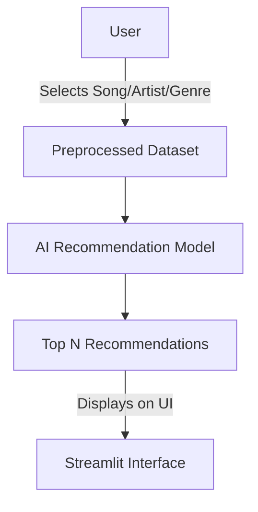
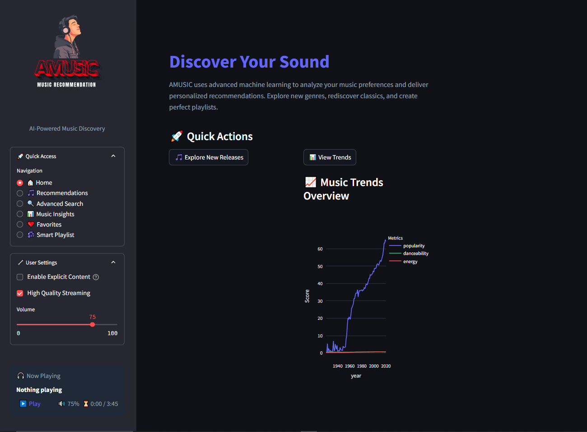
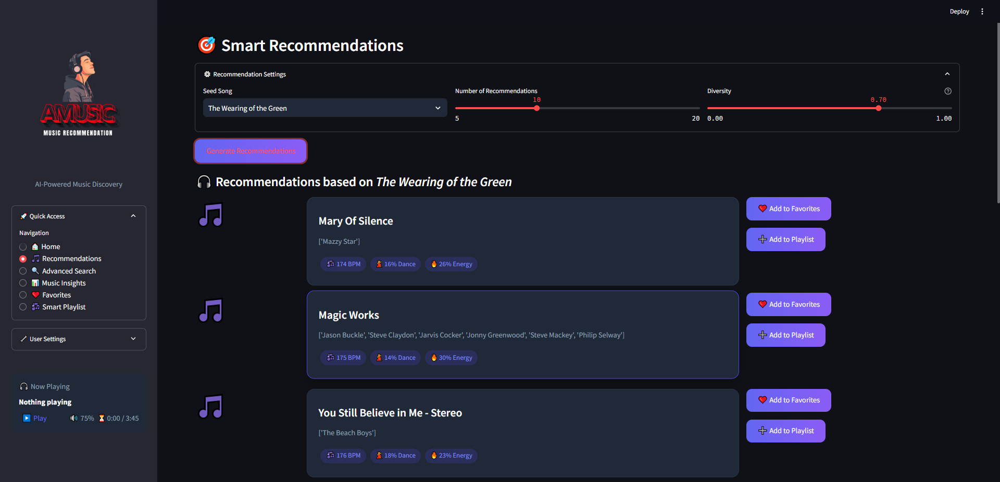
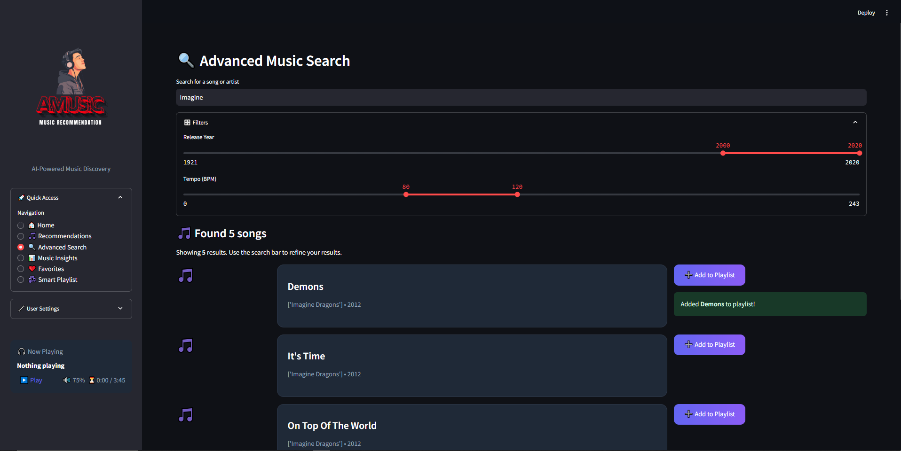
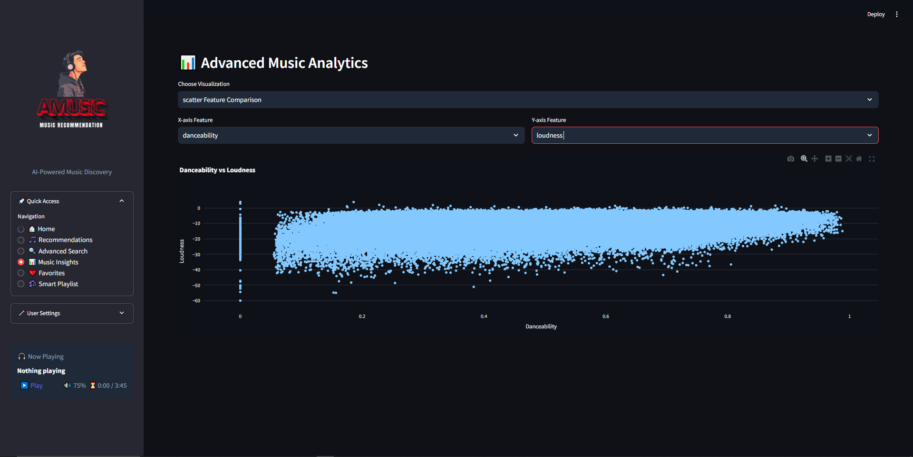
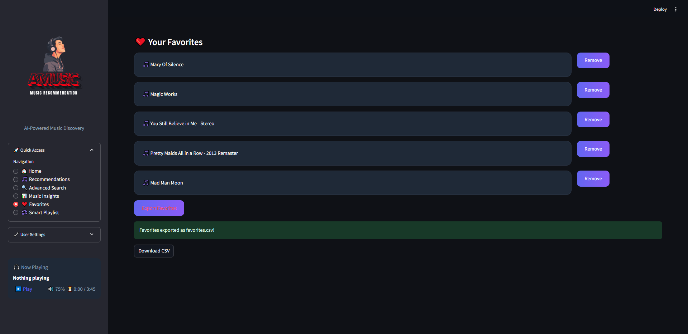
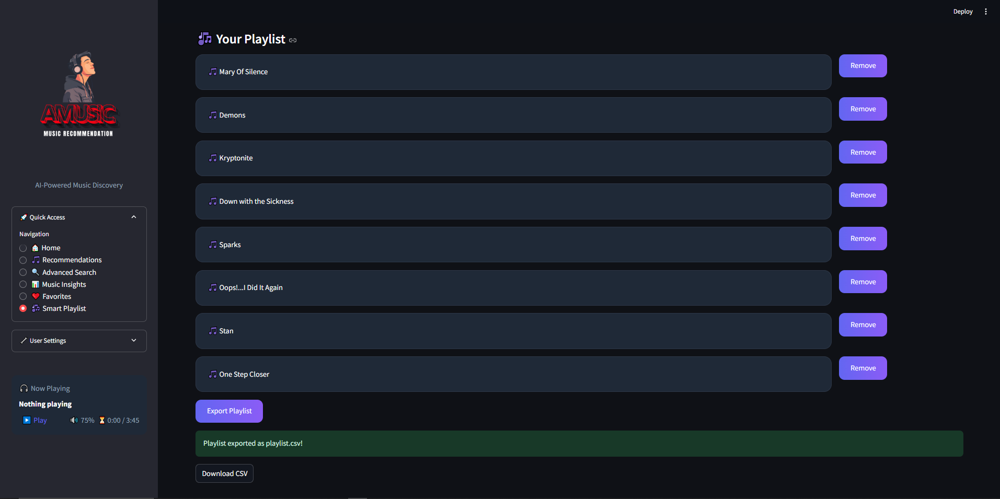

# 🎵 AMUSIC - AI-Powered Music Recommendation System


---

## 🚀 Project Overview

**AMUSIC** is an AI-powered **music recommendation system** that helps users discover new songs based on their preferences. It provides recommendations for songs, artists, and genres using **machine learning models**, along with interactive data visualizations for music trends.

📌 **What makes AMUSIC special?**

- 🎧 Personalized music recommendations using AI
- 🔍 Smart search for finding songs, artists, or genres
- 📊 Beautiful interactive visualizations for trends & analytics
- 🎨 Clean & user-friendly UI powered by Streamlit
- 🔥 Future-ready with real-time streaming capabilities

---

## ✨ Features

| Feature                                | Description                                              |
| -------------------------------------- | -------------------------------------------------------- |
| 🎵 **AI-Powered Recommendations**      | Get song suggestions based on your favorite music        |
| 🔍 **Smart Search**                    | Find songs by title, artist, or genre with detailed info |
| 📊 **Interactive Data Visualizations** | Explore trends, correlations, and popularity insights    |
| 📌 **Custom Playlists & Favorites**    | Save songs you love and create personal playlists        |
| 🎨 **Beautiful UI**                    | Designed with Streamlit & enhanced with CSS              |
| 🤖 **Machine Learning Insights**       | Uses advanced algorithms for recommendations             |

---

## 📥 Installation & Setup

### 1️⃣ Clone the Repository

```bash
git clone https://github.com/WasifSohail5/MusicRecommendationSystem.git
cd MusicRecommendationSystem
```

### 2️⃣ Install Dependencies

```bash
pip install -r requirements.txt
```

### 3️⃣ Run the Application

```bash
streamlit run Music.py
```

---

## 📌 Usage Guide

```
📌 AMUSIC follows this workflow:

    [ User ] → [ Selects Song / Genre / Artist ] → [ AI Model ] → [ Recommendations ] → [ Display Results ]
```

1️⃣ **Home Page** - Overview of the system with trending music insights.\
2️⃣ **Recommendations** - Get AI-powered song suggestions.\
3️⃣ **Search** - Find music details and play tracks.\
4️⃣ **Visualizations** - Explore music trends through charts & heatmaps.\
5️⃣ **Top Trends** - View the most popular songs & artists.

---

## 📊 Dataset Details

The project uses multiple datasets for recommendation and analysis:

📂 **Datasets:**

- `🎵 data.csv` - Contains song metadata & features
- `🎤 data_by_artist.csv` - Aggregated data by artists
- `🎼 data_by_genres.csv` - Data grouped by genres
- `📅 data_by_year.csv` - Year-wise music trends

These datasets are processed and used to train **machine learning models**.

---

## 🖥️ System Architecture



---

## 📸 Screenshots

Here are some previews of AMUSIC in action:

### 🎧 Home Page


### 🎼 Music Recommendations


### 🔍 Smart Search


### 📊 Data Visualizations


### 📈 Favourities


### 🎶 User Playlist


## 🧠 Technologies Used

| Technology              | Purpose                   |
| ----------------------- | ------------------------- |
| 🐍 **Python**           | Core programming language |
| 📊 **Pandas & NumPy**   | Data processing           |
| 🎨 **Streamlit**        | UI development            |
| 📈 **Plotly & Seaborn** | Data visualization        |
| 🤖 **Scikit-learn**     | Machine learning          |

---

## 🔥 Future Enhancements

✅ **Real-time music streaming integration**\
✅ **Deep learning-based recommendation system**\
✅ **More advanced filtering & sorting options**\
✅ **Better UI with Dark Mode & Themes**

---

## 👨‍💻 Contributors

- **Wasif Sohail** - Developer & AI Engineer

📬 Want to contribute? Fork this project and submit a PR! 🚀

🔗 **Connect with me on LinkedIn:** [Wasif Sohail](https://www.linkedin.com/in/wasif-sohail-4381602b4)

---

🎵 **Enjoy discovering new music with AMUSIC!** 🎵

